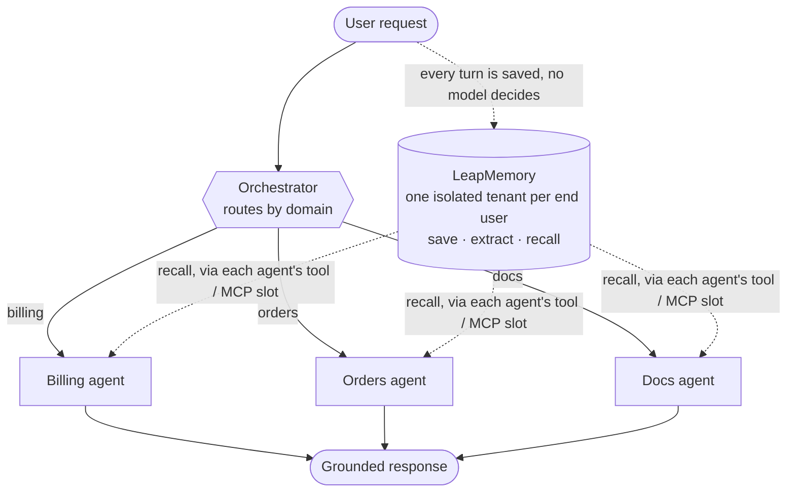

# Extra + LeapMemory: Session-Proof Memory Demo

An [extra](https://github.com/extra-org/extra) agent whose sessions are disposable, backed by
[LeapMemory](https://leapmemory.com) so the customer is not.

A customer tells a support agent five things across five separate sessions.
Every session dies. Six brand-new sessions later, the agent answers every
question about the customer correctly, and refuses to invent the one thing
the customer never said. Every claim is verified from extra's own store
(`chat.db`), not from model output.

## Run it

```bash
pip install requests
# .env: model provider keys + LM_API_KEY + LM_TENANT
python3 demo.py
```

The demo is self-resetting: on every start it provisions a fresh LeapMemory
tenant, deletes the previous run's tenant, and clears extra's `chat.db`. Run
it as many times as you like. After a run, the tenant's History and memory graph in the
LeapMemory dashboard contain exactly that run's story, so the transcript can
be checked against the store.

It also writes `demo_transcript.txt`, a plain-text copy of the full output.

## The three acts

1. **SAVE.** Five conversations, five sessions. After each session ends, the
   customer's words are read back from `chat.db` and posted to LeapMemory's
   ingest API. Every turn, unconditionally. No model decides what is worth
   keeping.
2. **EXTRACT.** Server-side, LeapMemory's extractor turns raw words into
   structured facts. The script calls the recall API directly with the exact
   questions Act 3 will ask, and waits until every answer is retrievable.
   No agent runs in this act.
3. **ANSWER.** Six fresh sessions with zero history. The agent's only path
   to the answers is its `recall_customer` tool, which passes the customer's
   question to LeapMemory. Tool usage is proven from `chat.db` per session.

## The design in one line

**Writes are infrastructure. Reads are questions.**

Saving through a model-invoked tool was measured first: the model silently
skipped 2 of 5 facts. So saving moved out of the model entirely. Recall stays
a tool because a read has a trigger and a shape: the customer's own question.
It went 5 of 5.

## Where LeapMemory fits in extra's architecture

Extra's own diagram, extended. LeapMemory occupies the existing
`tools / MCP` slot of any agent for reads, and adds the one plane the engine
deliberately does not have: memory that survives the request.



Solid arrows are extra, unchanged. Dotted arrows are the integration:
turns flow in unconditionally at the persistence layer, and any agent reads
back through the slot extra already gives it. Sessions stay stateless and
cheap, exactly as the engine intends. The memory lives elsewhere, per end
user, in physically separate databases.

In this demo the read path is a local plugin tool (15 lines,
`plugins/tools/recall_customer.py`). In production the same read is available
as an MCP server, which extra speaks natively:

```yaml
mcps:
  leapmemory:
    url: "https://api.leapmemory.com/mcp"
```

## Layout

```
agents.yml                        the whole agent system, extra style
prompts/system.md                 the support agent's prompt
plugins/tools/recall_customer.py  the read path into LeapMemory
demo.py                           the three acts, the proofs, the transcript
```

## Links

- LeapMemory: https://leapmemory.com
- API reference: https://leapmemory.com/docs/api
- Extra: https://github.com/extra-org/extra